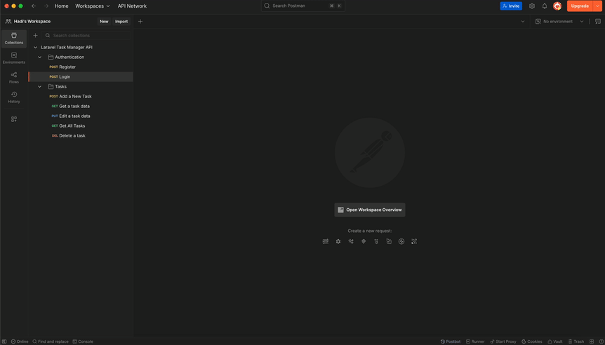

# Laravel Task Manager API - A DevOps-friendly Portfolio

[](https://github.com/hadinshb/laravel-task-manager/actions/workflows/ci.yml)

A DevOps-friendly sample project showcasing best practices in Laravel 12, API design, testing, and modern development workflows.

---

## ✨ Key Features & Technologies

This project demonstrates a robust set of skills and modern technologies:

* **Backend:** Laravel 12, PHP 8.3
* **Architecture:** API-First design, Action Classes, PHP 8.1+ Enums
* **Authentication:** Laravel Sanctum for token-based API authentication.
* **Authorization:** Laravel Policies to ensure users only access their own data.
* **Asynchronous Processing:** Redis and Queues for background jobs (e.g., sending notifications).
* **Containerization:** Fully containerized environment using Docker & Docker Compose.
* **Testing:**
    * Comprehensive test suite using **Pest**.
    * **Feature Tests** for API endpoints and authorization.
    * **Unit Tests** with Mocking for isolated logic.
* **CI/CD:** Automated testing and code quality checks with **GitHub Actions**.
* **Code Quality:**
    * **Pint** for automated code styling (PSR-12).
    * **PHPStan (Larastan)** for static analysis (Level 5).

---

## 🚀 Getting Started

### Prerequisites

* [Docker Desktop](https://www.docker.com/products/docker-desktop/)

### Installation & Setup

1.  **Clone the repository:**
    ```bash
    git clone https://github.com/hadinshb/laravel-task-manager.git
    cd laravel-task-manager
    ```

2.  **Create your local environment file:**
    This is a crucial step for Docker Compose to read the necessary variables.
    ```bash
    cp .env.example .env
    ```

3.  **Build and start the containers:**
    ```bash
    docker compose build
    docker compose up -d
    ```
    On the first run, the application's entrypoint script will automatically generate the app key and run database migrations.
    The application will be available at `http://localhost:8008`.
---

## 🧪 Running Tests

To run the full test suite (both feature and unit tests), use the following command:

```bash
docker compose exec app php artisan test
```

## 📚 API Documentation

This project follows RESTful API standards. A full Postman collection is available to test and interact with all endpoints.

* [**View Postman Collection**](postman_collection.json)
* You can also import the `postman_collection.json` file located in the project root.

